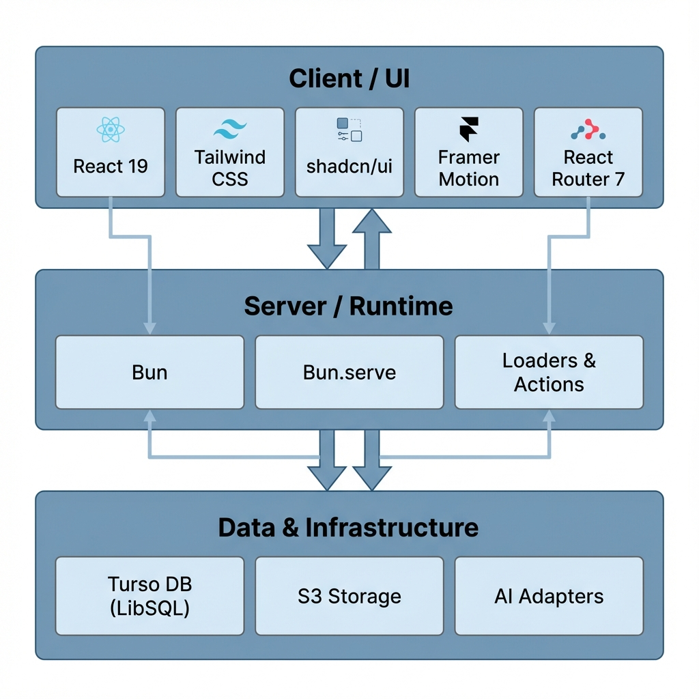

# Project Information



- **Goal**:
- **Pipeline**:
- **Approach**: Ship on React Router 7 with Bun.serve, leaning on Bun’s native S3/MySQL/Shell `$` APIs for persistence, storage, and workflows.
- **UI Stack**: React 19 + React Compiler (useMemo / useCallback redundant), Tailwind CSS, shadcn/ui components via `bunx shadcn@latest add ...`, and lucide-react icons.
- **Data & Services**: Keep AI adapters in `app/server/ai.server.ts`; prefer Bun-powered adapters (S3, MySQL) before third-party SDKs.
- **Database**: Turso, used via `@libsql/client`. All migrations and database config stored in `~/server/database.server.ts`.
- **React Router 7**: Whenever you make a new route, ENSURE that you add a corresponding entry in `routes.ts`.
- **Framer Motion**: `motion` v12 has been installed as a dependency, use it to add a nice touch to the UI.
- **UI**: Let's just keep it a nice and clean white mode (only) webapp. Make it heavily inspired by shadcn.

## React Router 7 – Best Practices (Framework mode)

### Architecture & mental model

- Prefer **Framework mode** so data flows through **loaders** (reads) and **actions** (writes) that are co-located with route modules; avoid ad-hoc `useEffect` fetching. Treat loader data as the source of truth.
- Use **typegen** for first-class types of route params, loader/action data, etc. (`react-router typegen`).
- v7 defaults to the **single-fetch** architecture (one request per navigation) that Remix introduced; design loaders/actions with that in mind.

## Loading data

- Load data in **route loaders**; return plain JS (or Promises for streaming with Suspense). Don’t use `defer`—it was removed. Use Suspense by **returning promises** instead.
- Keep loaders **pure** and cache-friendly: derive from `request.url`/params, not ambient client state. (This lets the router handle revalidation and cancellation.)

## Mutations: `<Form>` vs `useSubmit` vs `useFetcher`

- **Use `<Form>`** for normal, user-initiated submits that should **navigate** (adds a history entry) and then revalidate affected routes.
- **Use `useSubmit`** when you need to **submit imperatively** (autosave on change, timers, “Apply” buttons that aren’t within a `<Form>`), i.e., the “imperative version of `<Form>`.”
- **Use `useFetcher`** when you need to **load or mutate without navigation** (list item toggles, inline editors, modals, combobox search, multiple concurrent ops). Each fetcher has **independent pending/error/data state** and can render a `fetcher.Form`.
- For cross-component coordination (e.g., show a global “Saving…” while any fetcher is active), read **`useFetchers()`** and aggregate their states.

## Pending & optimistic UI patterns

- **Global pending**: read `useNavigation()` (`state`, `formData`) to drive spinners/disabled buttons across navigations.
- **Local pending**: prefer **`fetcher.state`** for per-widget pending (no global spinner/flicker).

- **Optimistic UI**:
  - For fetchers: derive “future” values from **`fetcher.formData`** while pending, then let revalidation reconcile.
  - For navigations: derive from **`navigation.formData`** similarly.
  - Keep the optimistic change **idempotent** and ensure the action can reconcile or reject cleanly.

## Revalidation (keeping data fresh)

- **Default**: loaders **re-run after navigations and submissions**. Fine-tune with **`shouldRevalidate(args)`** to skip unaffected routes (check URLs, params, or `actionResult`). Be conservative—stale UIs are worse than an extra fetch.

## Navigation & programmatic control

- Prefer `<Link>`/`<Form>` for most UX. Reserve **`useNavigate`** for **non-interactive** cases (timeouts, guards, logout after inactivity).

## Prefetching for snappy UX

- Use `<Link prefetch="intent|render|viewport">` to prefetch **modules and data**; start with `intent` for desktop, `viewport` for mobile lists.
- Use **`<PrefetchPageLinks page="/path" />`** to prefetch outside of a visible `<Link>` (e.g., after a search result renders).

## Errors & validation

- Use **route-level error boundaries** (`ErrorBoundary`/`errorElement`) for thrown loader/action/component errors; read via `useRouteError()`.
- Don’t put form validation in error boundaries—**return action data** and render field errors in the route component.

## Redirects & auth

- Redirect by **throwing `redirect("/path")`** from loaders/actions (a proper `Response`). Avoid client-only redirects for auth gates.

## Package & imports (v7 specifics)

- In v7, import from **`react-router`** (not `react-router-dom`) for most APIs; use `react-router/dom` only for DOM-specific pieces like `RouterProvider` SSR hydration helpers. The official upgrade path codemod replaces imports.

## Quick decision guide

**I’m…** → **Use…** → **Why**

- Submitting a typical form and should navigate → `<Form>` → standard UX + auto-revalidation.
- Auto-saving on change / submitting from code → `useSubmit` → imperative submit without extra wrappers.
- Toggling a row / inline edit / modal submit without URL change → `useFetcher` (or `fetcher.Form`) → isolated pending/error state, no navigation.
- Showing “Saving…” anywhere when _any_ fetcher is busy → `useFetchers()` → aggregate in-flight work.
- Showing a global spinner between pages → `useNavigation()` → reflects navigation state + `formData`.
- Making the next click instant → `<Link prefetch="intent|viewport">` or `<PrefetchPageLinks>` → prefetch modules & data.
- Avoiding unnecessary reloads after a submit → `shouldRevalidate(args)` → skip if URL/params/actionResult prove it’s unaffected.

## Micro-patterns (copyable)

**Optimistic toggle with `useFetcher`**

```tsx
function TodoItem({ todo }: { todo: { id: string; done: boolean; title: string } }) {
	const fetcher = useFetcher();
	const optimisticDone = fetcher.formData?.get("done")?.toString() === "true" ?? todo.done;

	return (
		<fetcher.Form method="post" action={`/todos/${todo.id}/toggle`}>
			<input type="hidden" name="done" value={(!todo.done).toString()} />
			<button type="submit" aria-busy={fetcher.state !== "idle"}>
				{optimisticDone ? "✅" : "⬜️"} {todo.title}
			</button>
		</fetcher.Form>
	);
}
```

(Use `fetcher.formData` while pending, let revalidation sync after the action completes.)

**Autosave with `useSubmit`**

```tsx
function PreferencesForm() {
	const submit = useSubmit();
	return (
		<Form onChange={(e) => submit(e.currentTarget)} method="post" action="/settings">
			{/* inputs... */}
		</Form>
	);
}
```

(Imperative submit from code paths like `onChange`.)

**Prefetch a likely next page**

```tsx
// In a parent/layout where you know the next page:
<PrefetchPageLinks page="/dashboard/reports" />
// or let links handle it:
<Link to="/products" prefetch="intent">Products</Link>
```

### Footnotes worth knowing

- **Removed in v7**: `defer`, `json`, and some unstable upload helpers—replace with Suspense/Promises and plain objects/`Response`.
- Prefer **server-side redirects** and server-validated forms; keep client validation for UX only.
