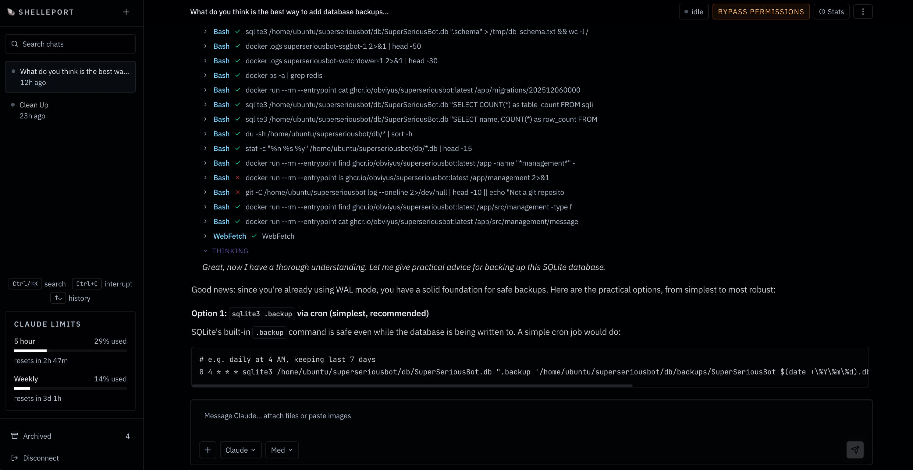

# 🐚 shelleport



**A web UI for your coding agents, anywhere.**

Start, monitor, and interact with AI coding sessions on any machine. All from your browser.

## Getting Started

### Prerequisites

- A coding agent CLI installed and authenticated (e.g. [Claude Code](https://docs.anthropic.com/en/docs/claude-code))

### Install & Run

Pick one path:

#### 1. Local machine

Install with npm:

```bash
npm i -g shelleport
shelleport serve
```

Or download the latest binary from [Releases](https://github.com/obviyus/shelleport/releases) and run:

```bash
shelleport serve
```

This binds `127.0.0.1:1206`.

#### 2. Remote access over Tailscale

```bash
shelleport serve --tailscale
```

Use this on a VPS or workstation you already reach through your tailnet.

#### 3. Background service

```bash
sudo shelleport install-service --tailscale --service-user ubuntu
```

Use this when you want shelleport to survive reboots and start automatically.

If you really need every interface exposed:

```bash
shelleport serve --public
```

### Install as a Service

Shelleport can install itself as a background service that starts automatically:

```bash
sudo shelleport install-service --tailscale --service-user ubuntu
```

This writes a service definition for your platform and starts it immediately.
On Linux this installs the native binary at `/usr/local/lib/shelleport/shelleport`, creates `/usr/local/bin/shelleport`, writes a plain systemd unit at `/etc/systemd/system/shelleport.service`, and runs it as the selected `--service-user`.
By default, service installs stay on `127.0.0.1`. Pass `--tailscale` to bind the machine's Tailscale IPv4, or `--public` if you explicitly want every interface exposed.

### Upgrade

Upgrade the installed binary in place with:

```bash
shelleport upgrade
```

On Linux, this also repairs the systemd unit, reloads it, upgrades the binary, and restarts `shelleport.service` when it is installed.

### Health Check

```bash
shelleport doctor
```

Verifies your data directory, CLI availability, host/port config, and token status.

## Features

- Real-time SSE streaming with automatic reconnection
- Syntax-highlighted tool call visualization with collapsible cards
- Inline permission approvals (Allow/Deny) for tool boundaries
- Finder-style directory browser to launch sessions in any directory
- Image attachments via paste or upload
- Session archive, restore, interrupt, and terminate
- Historical session import from `~/.claude/projects`
- Rate limit detection with live retry countdown
- Native single-file per-platform binaries built with `bun build --compile`
- Background service install (launchd / systemd)

### Planned

- Codex App Server support
- Skills
- Automations
- Settings

## Supported Agents

| Agent           | Live Sessions | Historical Import |
| :-------------- | :-----------: | :---------------: |
| **Claude Code** |      Yes      |        Yes        |
| **Codex**       |    Planned    |      Planned      |

The provider system is extensible — add new agents by implementing the `ProviderAdapter` interface.

## Configuration

### Authentication

On first launch, shelleport generates a random admin token and prints it to the console. The token is only shown once — save it. Only the hash is stored.

To regenerate the token (invalidates all existing sessions):

```bash
shelleport token
```

### Environment Variables

| Variable                 | Default     | Description                                                                                                    |
| :----------------------- | :---------- | :------------------------------------------------------------------------------------------------------------- |
| `HOST`                   | `127.0.0.1` | Bind address                                                                                                   |
| `PORT`                   | `1206`      | Bind port                                                                                                      |
| `SHELLEPORT_TRUST_PROXY` | unset       | Trust `X-Forwarded-For` / `X-Real-IP` for login rate limiting only when running behind a trusted reverse proxy |

CLI flags:

- `--host <address>` bind to one address
- `--public` bind to `0.0.0.0`
- `--tailscale` bind to the machine's Tailscale IPv4
- `--port <port>` override the port
- `--service-user <user>` Linux systemd service user for `install-service`
- `-h, --help` show usage
- `-v, --version` show version

### Data Storage

All data lives in `$XDG_DATA_HOME/shelleport` (defaults to `~/.local/share/shelleport`). The SQLite database stores sessions and events. Image attachments are saved in each session's working directory under `.shelleport/uploads/`.

## Remote Access with Tailscale

Shelleport binds to `127.0.0.1` by default. For direct access over your tailnet, bind to the Tailscale IP:

```bash
shelleport serve --tailscale
```

If you prefer Tailscale HTTPS proxying instead, keep Shelleport on loopback and use [Tailscale Serve](https://tailscale.com/kb/1242/tailscale-serve):

```bash
tailscale serve --bg 1206
```

## API Reference

Shelleport is API-first. Every action in the UI goes through the HTTP API.

### Sessions

```
POST   /api/sessions                  # Create a new session
GET    /api/sessions                  # List all sessions
GET    /api/sessions/:id              # Get session details
GET    /api/sessions/:id/events       # SSE event stream
POST   /api/sessions/:id/input        # Send a follow-up prompt
POST   /api/sessions/:id/control      # Interrupt or terminate
POST   /api/sessions/import           # Import historical sessions
```

### Approvals

```
POST   /api/requests/:id/respond      # Allow or deny a permission request
```

### Other

```
POST   /api/auth/session              # Exchange admin token for auth cookie
GET    /api/auth/session              # Validate current auth cookie
DELETE /api/auth/session              # Clear auth cookie
GET    /api/providers                 # List available providers
GET    /api/providers/:name/sessions  # List sessions for a provider
GET    /api/directories               # Browse host directories
```

API endpoints require the auth cookie after login. Bearer auth still works for direct API callers.

## Development

```bash
bun run dev          # Bun hot-reload dev server for server + client edits
bun run build        # Ahead-of-time client bundle
NODE_ENV=production bun run server.ts serve  # Run from source
bun run compile      # Build the local standalone binary
bun run typecheck    # Type-check with tsgo
bun run lint         # Lint with oxlint
bun run format       # Check formatting with oxfmt
bun run test         # Run tests
bun run smoke        # Verify the compiled binary works without build/
bun run test:claude  # Run Claude integration tests
```
